# Term 3 Assignment 1 - Workbook

## 1. 	Provide an overview and description of a standard source control process for a large project

GitHub is a tried and tested tool for source control and has several features which assist with managing large projects. Some of the key features to ensure robust source control management include:

- **Version control integration** -  GitHub can track all changes made to a repository including some comments, dates and a comparison between the repository before and after the commit was made. 
- **Branch protection** - Ability to create separate branches to where the main functionailty of a software is kept. This allows developers to work on updates on a separate branch without impacting the operation of the main features. 
- **Pull requests** - With pull requests, GitHub makes collaborative coding easier. Developers can request modifications by submitting a pull request (PR), which team members can evaluate, comment on, and accept. Before merging into the main branch, this procedure guarantees code quality, peer review, and conformance to coding standards.
- **Security access and controls** - Granular access control is provided by GitHub, which enables administrators to specify permissions at the repository level for various roles (such as write, read, and admin) to guarantee that only authorised individuals can merge or modify important codebase sections.

There are also several other features offered by GitHub to ensure proper source control for projects, however the above are just some of the main key features developers would look for. How GitHub would be used in practise for a large scale project would be as follows:

1. A repository would be created at the beginning of a new project to act as the main database for where the live version of a project and it's features would be held. This can be considered the 'main' branch for a project in development and the live version of the software would sit here.  
2. Several branches will be created whenever a developer is creating a new feature to be deployed to the main software at a future date. This allows for development and testing to take place with full functionality of the software without affecting the live version. 
3. As development takes place, several commits will be made to ensure that the feature is constantly being updated and Github will track the various version and commits for history and security. This will allow fordevelopers to rollback changes if siginificant issues arise and also keep track of what has been chaged and by who. 
4. Once the feature has been developed and is ready to be merged back into the main branch of the repository, developers can issue a pull request which allows a senior developer to review the work prior to this being merged into the main branch. This is an addtional layer of security to ensure that any work that can affect the main branch is vetted and approved prior to committing. 
5. Once a pull request has been approved, the feature will be merged into the main branch wth GitHub recording the changes and all comments to ensure all history is available.

## 2. What are the most important aspects of quality software?

To achieve dependability, maintainability, and user happiness, high-quality software is necessary. The most important aspects of quality software typically revolve around functional and non-functional qualities.

- **Functionality** - The software needs to function as intended and fulfil the required specifications. It ought to effectively resolve the issue for which it was intended. Every feature and function that the user need and that is outlined in the design should be included in the software. The software's capacity to easily communicate with other softwaremes or systems, including third-party tools or APIs. No matter how technical the users are, the software should be simple to use, intuitive, and straightforward to utilise.
- **Reliability** - Under both expected and unexpected circumstances, the software should operate consistently without crashing or producing errors. When mistakes do happen, the software need to manage them tactfully, displaying informative alerts without compromising functionality or overall performance. It ought to be built to continue functioning even in the event of a partial system failure, reducing downtime or data loss.
- **Performance** - The software should prevent pointless calculations or sluggish operations and make the best use of available resources (memory, CPU, bandwidth, etc.). The software ought to have the capacity to manage an increase in demand (such as an increase in users, data, or transactions) without experiencing any decline in performance. User inputs should be processed by the software rapidly, and it should finish tasks without needless delays.
- **Maintainability** - It will be simpler for developers to maintain and improve the system if the code is clear, well-structured, adheres to coding standards, and is easy to read and comprehend. It should be simple to test the software, with appropriate unit, integration, and end-to-end tests, so that updates may be confirmed without resulting in regressions. Without needing extensive rewriting, the software should be simple to grow, change, or adapt to new requirements in the future.
- **Security** - Sensitive information should be protected by the software, which should make sure it is handled, encrypted, and kept safely. It should have the appropriate systems in place to verify user identities and manage user access to various functionalities according to roles and permissions.
- **Scalability and flexibility** - It should be possible to extend the user base, data volume, and transaction volume of the software without having to make significant architectural adjustments. It must be flexible enough to adjust to shifting market dynamics, technological advancements, or corporate needs without requiring a lot of new work.
- **Compliance** - Complying with industry norms and regulations is crucial for software to ensure legal and operational compliance. Best practices, industry standards, and selected architecture patterns should all be adhered to by the code.

## 3. Outline a standard high level structure for a MERN stack application and explain the components

The MERN stack is a popular technology stack for building web applications. It includes MongoDB, a NoSQL database that stores data in a flexible, JSON-like format, allowing for easy scalability and efficient data management. Express.js is a web application framework for Node.js that simplifies creating server-side applications and APIs, offering robust features and middleware support. React, a front-end library developed by Facebook, is used to build dynamic, user-friendly interfaces with reusable UI components and efficient state management. Node.js provides the server-side environment for running JavaScript code, enabling the development of scalable network applications. Together, these technologies allow developers to use JavaScript across both the client and server sides, streamlining development and improving integration.

- **MongoDB** - MongoDB is a NoSQL database that stores information in BSON (Binary JSON), a versatile format like JSON. It use collections of documents rather than tables, in contrast to conventional relational databases, enabling dynamic schema construction. Because of its adaptability, MongoDB works effectively with massive amounts of unstructured or semi-structured data. Its strong query capabilities, indexing, and scalability make it a popular option for contemporary applications that need to store and retrieve data quickly and effectively.

- **Epress.JS** - Server-side apps and APIs can be developed more easily with Express.js, a Node.js framework for lightweight web applications. It offers a comprehensive feature set for managing sessions, routeing, middleware integration, and HTTP requests and responses. Express.js is a well-liked option for developing RESTful APIs and dynamic web apps because it enables developers to create scalable and maintainable server applications with less setup and configuration.

- **React** - Facebook created the JavaScript package React to help developers create user interfaces, especially for single-page applications. It makes it simpler to design and manage intricate, dynamic interfaces by enabling developers to create reusable user interface components that are capable of managing their own state. React uses a virtual DOM to efficiently update and render components in response to data changes, improving user experience and efficiency. It is a well-liked option for contemporary web development because of its robust ecosystem and component-based architecture.

- **Node.js** - Developers can run JavaScript on the server side with Node.js, a JavaScript runtime built on top of Chrome's V8 engine. Because of its event-driven, non-blocking architecture, it makes it possible to create network applications that are both scalable and high-performing. Because of its vast package ecosystem, which is controlled by npm (Node Package Manager), Node.js is especially well-suited for developing real-time applications like chat apps or live streaming services. This makes it easier to integrate different features and libraries.

## 4. A team is about to engage in a project, developing a website for a small business. What knowledge and skills would they need in order to develop the project?

To successfully develop a website for a small business, a team needs a diverse set of knowledge and skills, spanning technical, creative, and managerial domains. These skills include:

- **Front-End Development** - Building a website or online application's user interface (UI) and user experience (UX) is the main goal of front-end development. In order to build the layout, design, and interactive features that users see and interact with in a browser, it entails using technologies such as HTML, CSS, and JavaScript. Making sure the website is functional, aesthetically pleasing, and responsive across a range of devices and browsers is the aim. Additionally, front-end developers maximise accessibility and speed to make the website user-friendly and quick to load.

- **Back-end development** - The server-side portion of web development, known as back-end development, focuses on the logic, functionality, and database administration that underpin a website or web application. It entails programming code to manage databases, process data, and handle server requests in languages like Python, Node.js, PHP, or Java. Back-end engineers build APIs, control user authentication, and handle business logic to make sure websites run smoothly. Their efforts guarantee the proper, safe, and effective operation of the website in the background.

- **Design and User experience** - In order to improve user interaction with a website or application, design and user experience (UX) concentrate on developing aesthetically pleasing and intuitive interfaces. Whereas UX makes ensuring the website is user-friendly, intuitive, and efficiently satisfies user demands, design deals with the structure, colours, font, and overall appearance.
Because they have a direct impact on user happiness, engagement, and retention, good design and user experience are crucial. A well-designed website increases performance, accessibility, and usability, increasing the likelihood that users will remain longer, have a good experience, and effectively accomplish their objectives.

- **Agile project management** - Agile methodology is a flexible approach to project management that places an emphasis on teamwork and ongoing progress through short development cycles, or sprints, that run anywhere from one to four weeks. Delivering tiny, incremental updates to a project is its main goal, which enables teams to quickly adjust to changes. Agile makes use of frameworks like Scrum, which have rituals like daily stand-ups and sprint planning in addition to roles like Scrum Master and Product Owner. Kanban is a different framework that emphasises using boards to visualise work for continuous delivery. User stories, which are brief, user-focused tasks that specify certain features, are an essential part of Agile. Workloads are prioritised according to company value and user needs thanks to backlog management. Agile encourages stakeholders to provide feedback often, which enables teams to make changes as the project progresses

- **Legal and regulatory compliance knowledge** - In Australia, the main areas of attention for web development legal and compliance rules are intellectual property, privacy, accessibility, and data protection. Businesses must obtain explicit consent and handle user information securely in order to collect, retain, and utilise personal data in accordance with the Privacy Act 1988 and the Australian Privacy Principles (APPs). In accordance with the Disability Discrimination Act of 1992, it is also advised that websites adhere to the WCAG (Web Content Accessibility Guidelines). Additionally, when developers use content from third parties, such as photos, typefaces, or code libraries, copyright regulations under the Copyright Act 1968 guarantee them against legal problems. These rules guarantee that websites are safe, accessible, and complied with Australian law.

- **Post-launch support and maintenance** - In website creation, post-launch support and maintenance refers to continuing efforts to make sure the website functions well, stays safe, and is updated. Important procedures include keeping an eye on performance to ensure quick load times and the best possible user experience, as well as updating software, plugins, and frameworks on a regular basis to address issues and enhance functionality. Security fixes are necessary to guard against vulnerabilities, and backups guarantee that data may be recovered in the event of a problem. In addition, maintenance entails repairing broken links, SEO-optimizing material, and offering technical assistance for user requests or problems. By following these procedures, the website is kept safe, secure, and in line with changing user requirements.

## 5. With reference to one of your own projects, discuss what knowledge or skills were required to complete your project, and to overcome challenges

For my web portfolio project as part of the CA curriculum, I was required to have a deep understanding of HTML and CSS principles. In addition to these technical skills, some additional soft skills were required such as problem solving, resilience and organisation. 

The standard language for creating and organising material on the web is HTML, or HyperText Markup Language. It uses features like headings, paragraphs, links, images, and forms to determine how web pages should be laid out. All web content is built on HTML, which enables browsers to present text, multimedia, and interactive features in an organised manner. It is necessary to create the basic framework of web pages, which JavaScript and CSS may subsequently design and make interactive. This was the baseline necessary for me to display information about myself, my projects, aspirations and contact details whe developing my webpage. At the time, I wasn't skilled in Javascript and so I resorted to CSS to implement design aspects to my webpage. 

A stylesheet language called CSS (Cascading Style Sheets) is used to manage how web pages look and are laid out. By defining styles for things like colours, fonts, spacing, and positioning, it specifies how HTML components should be rendered. With CSS, developers can create designs that are both aesthetically pleasing and consistent across various web pages. Additionally, it facilitates responsive design, which enables websites to adjust to different screen sizes and gadgets. In my project, I utilised CSS in creative ways to implement design and function parameters to my webpage to make it more appealing, user friendly and accessible. 

As my knowledge of these technical principles was limited at the time, it was very important for me to be able to troubleshoot and use external resources to problem solve and improve upon my skills. This required a lot of googling, accessing external web sources or even web tutorials online to answer specific questions to problems I was having at the time. This could be about formatting, positioning of elements on screen, different font/colour types or dynamic functionality. Being able to identify a problem and effectively use the resources available to me to resolve these issues was one of the most valuable skills when developing my project and pushing myself to create something beyond my capabilities at the time. 

This also came with a lot of setbacks and trial and error to get things working as expected. As such, resilience is also another key skill when trying something new as it is easy to give up or just create an MVP. However, I ensured that I pushed on until I developed a website that was reflective of my original vision and well within the parameters of what I knew was possible. 

Lastly, setting off onto a new project comes with it's own set of challenges and understanding what needs to be done and the time left to do it is important to ensuring we meet deadlines. Having good organisational skills and setting out a plan/design early on the development allowed me to properly visualise the workload remaining, estimate how much time I would need and ensure that fit within the schedule and kept me on track. As such, my project was delivered in full and on time. 

## 6. With reference to one of your own projects, evaluate how effective your knowledge and skills were for this project, and suggest changes or improvements for future projects of a similar nature

In respect to my terminal application using python, I required extensive programming knowledge and understanding of python features as well as again utilising soft skills similar to the web development project such as problem solving, organisation and resilience. I created a terminal application which was a text based fighting game which would allow users to create a fighter, upgrade a fighter and participate in a series of matches against CPU opponents who had their on randomised actions. 

This was a large project for me and I wanted to push myself to create something vastly different to what we learned in class. We explored concepts of functions, variables and classes and I tried to understand how to implement those in different ways to essentially create characters, menu's and simulators for battling and upgrading. Whilst my knowledge was close to suficient as I could create most of these elements using classes, functions and variables, there were certain aspects which I needed to research to develop. These were largely the CPU functions and how to randomise terminal responses to specific actions and inputs from the user. This required a lot of research on the best ways to implement these functions and randomise interactions. 

Overall, this project was achievable within the time constraint and I was proud of what I accomplished. Upon review, some suggestions I have for future projects would be this:

- Allowing myself more time at the end of a project to review the code and made minor changes to ensure it is D.R.Y and as efficient as possible. I found that I completed my project very close to deadline and didn't have enough time to really review the code and ensure I kept within the coding principles that I wanted which was PEP8. Whilst I largely did this as I went along, there were areas I missed and wasn't able to fix. 
- Before jumping into the coding aspect, really plan out the different elements and understand where the overlaps are to ensure I am not repeating myself anywhere. My battle simulator ended up being a very large chunk of code which in practise could have been condensed to re-use certain elements by developing additional functions outside of the sim and just calling on them when necessary. This would have made for a cleaner and more efficient code base and program. 
- Getting more user testing to ensure I have covered all error aspects and handled these elegantly. Whilst I did have a couple of users test my program prior to completion, I did still feel a little bit anxious that there were things that I had missed. Needing to have more user testing to ensure no surprises is a takeaway from this prject. 

## 7. Explain control flow, using an example from the JavaScript programming language

In JavaScript, "control flow" refers to the sequence in which the code is run in response to loops, conditions, and other instructions that manage the program's flow. Although control structures like conditionals, loops, and functions can change the order in which code is processed, code is typically performed top to bottom.

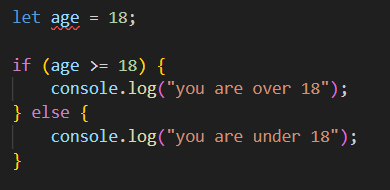  

The above code uses an if statement which can change the order in which code is processed. Typically, code will be executed from top to bottom however in the above instance, the order will be as follows:

- The program will check the value of age
- If the condition is true, the first bloc of code will execute "you are over 18"
- If the condition is false, then the code block will skip and instead the code within the else block will execute "you are under 18"

This shows how control flow can change based on different conditions. It will skip code blocks that do not adhere to the conditions and only execute the appropriate block of code. This can also be handled using loops such as for loops and while loops. 

## 8. Explain type coercion, using examples from the JavaScript programming language

In JavaScript, the term "type coercion" describes the implicit or automatic conversion of values between different data types. When JavaScript comes across an operation that involves mixed data types, such changing a string to a number or an integer to a boolean, it can execute type coercion. JavaScript may operate on mixed data types by implicitly or explicitly transforming them to the correct type through the use of type coercion. This can make the language more flexible, but if it's not understood correctly, it might also result in unexpected behaviour.

As example of string to number coercion is below:

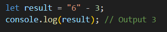

In the above example, Javascript converts the string "6" to a number so that it can substract 3, resulting in a number 3. 

Javascript can also perform number to string coercion and boolean coercion.

## 9. Explain data types, using examples from the JavaScript programming language

Within Javascript there are both primitive and non-primitive data types. Below are some examples:

### Primitive Data Types

- **String** - A string represents text and is enclosed in single (') or double (") quotes. 
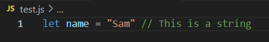

- **Number** - The Number type represents both integer and floating-point numbers.  
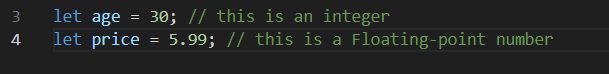

- **Boolean** - A boolean can have one of two values: true or false. It's often used for conditional logic.  

### Non-primitive data types

- **Object** - An Object is a collection of key-value pairs, where keys are strings (or symbols) and values can be any data type. 
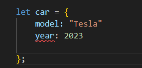

- **Array** - An Array is a special kind of object used to store ordered lists of values, which can be of any data type.  
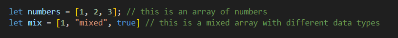

- **Function** - A Function is an object that can be executed. It’s used to perform actions or return values.  
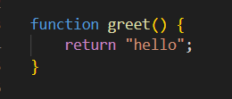

## 10. Explain how arrays can be manipulated in JavaScript, using examples from the JavaScript programming language

Arrays can be manipulated in multiple ways some of which include adding elements, removing elements, modifying elements, sorting elements. 

- **Adding elements** - Push() adds one or more elements to the end of an array  
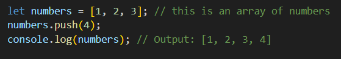

- **Removing elements** - Pop() removes the last element in an array  
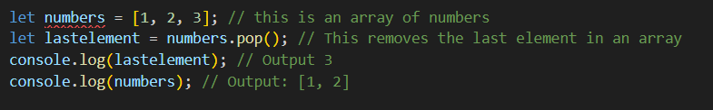

- **Modifying elements** - splice() adds/removes elements at a spcific index.  
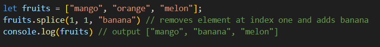

- **Sorting elements** - sort() sorts elements in an array.  
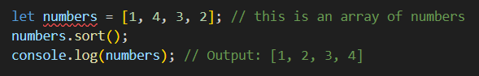

## 11. Explain how objects can be manipulated in JavaScript, using examples from the JavaScript programming language

## 12. Explain how JSON can be manipulated in JavaScript, using examples from the JavaScript programming language

